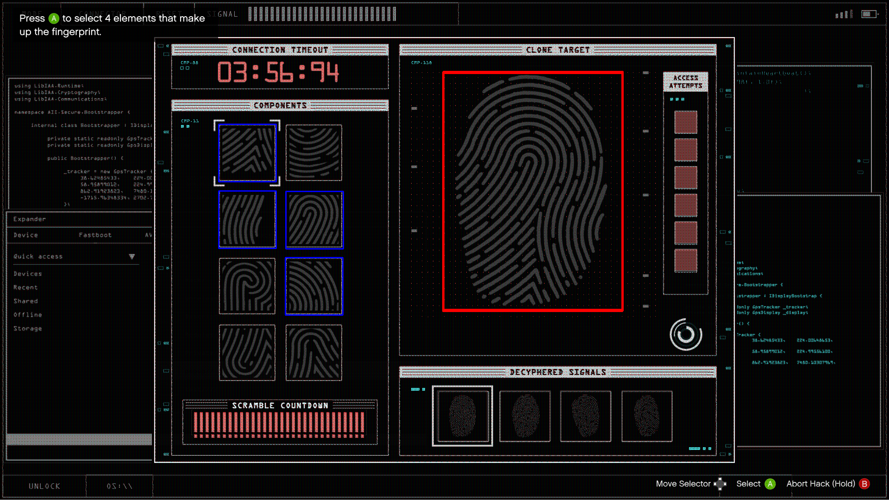

# GTA Online - Diamond Casino Heist Fingerprint Solver
Automatically solves the fingerprint "hack" in the GTA Online Diamond Casino Heist by utilizing image recognition to detect and match predefined fingerprint templates from screenshots.



## Credits
- **[mike546378](https://github.com/mike546378)** for the idea and inspiration behind this project.

## Install

This script requires Python 3 and the following dependencies to be installed via `pip`.

### Prerequisites:
1. **Python 3**: If you don't have Python installed, download and install Python 3 from [here](https://www.python.org/downloads/windows/).
2. **Install the required libraries**:
   Open a command prompt (Windows key + R, then type `cmd` and press Enter) and run the following commands:

   ```cmd
   pip install opencv-python
   pip install numpy
   pip install pillow

   ```

### Steam Setup for Screenshots:
Unlike **mike546378's** approach, this script uses in-game screenshots saved as high-quality PNG files to find the answers, rather than relying on screen recording. To ensure accurate fingerprint detection, it requires uncompressed `.PNG` screenshots, as the standard compressed `.JPEG` format from Steam does not allow for accurate recognition. To set this up, screenshot behaviour must be changed within **Steam** settings.
- To save screenshots from GTAV into the `screenshots` folder automatically:
1. **Open Steam** and go to **Settings** > **In-Game**.
2. Under the **Screenshots** section, make sure that **Save an external copy of my screenshots** is checked.
3. Set the **External screenshots folder** to the directory called `screenshots` within the script directory. (Alternatively you can edit the code to link to a different folder outside the script's directory.)

This ensures that GTAV's screenshots are saved as PNG files into the specified folder, which is required by this script.

## Running the Script

To run the script, you have several options:

1. **Using IDLE**: Open the `script.py` file in **IDLE** (which comes installed with Python) and press **F5** to run it.
2. **Double-click the script**: Simply double-click the script file to execute it if Python is properly associated with `.py` files on your system.
3. **Running in Command Prompt**:
   - Open a Command Prompt window.
   - Navigate to the folder containing the script using the `cd` command. For example:
     ```cmd
     cd path\to\script-folder
     ```
   - Run the script by typing:
     ```cmd
     python script.py
     ```

### Steps to run:
1. **Download and Extract** the repository to your local machine.
2. Open the `script.py` file in **IDLE**.
3. Ensure **GTA V** is running and set to **Fullscreen** for proper screen capture.
4. Press **F12** in-game to capture a screenshot of the fingerprint puzzle you want to solve. Make sure the screenshot includes only the puzzle itself and does not highlight any potential answers on the hacking screen.
5. **ALT + TAB** to the **IDLE or CMD** window and press **F5** to start the script.
6. The script will scan the screenshot for fingerprints and then display the edited screenshot in an image viewer, highlighting the correct answers with blue boxes.

### Important:
- This script currently works on **16:9 resolutions** with **1920 x 1080** screenshots. If you are using a different aspect ratio, ensure you set **GTA V** to a **windowed 16:9 resolution** before running the script.
- If you wish to use this program in **Windowed Fullscreen**, for the moment, you will need to create your own source images and edit the size of the drawn boxes in the code. I may implement this feature natively later.

## Troubleshooting
- Make sure **Steam** is configured to save screenshots in the correct folder and that **GTA V** is running in borderless window mode.
- Ensure you have the required Python packages installed via `pip` as listed above.

